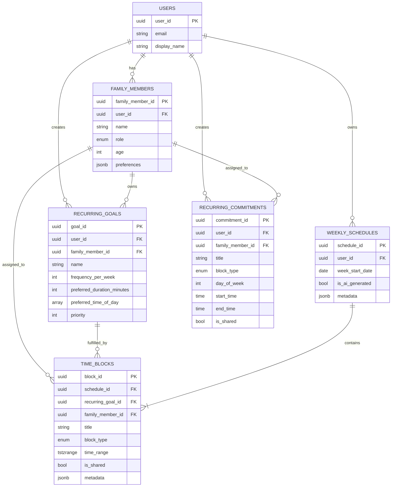

# Family Planner: Calendar, Activities & Family Integration Summary

## Overview

This document summarizes the implementation of the integrated calendar system that connects recurring goals, fixed commitments, family members, and AI-powered schedule generation into a unified weekly planning experience.

**Last Updated**: January 13, 2026

---

## Architecture Overview

### Data Model



---

## Core Concepts

### 1. Family Members

**Purpose**: Represent individuals in the family unit whose schedules need to be coordinated.

**Roles**:

- `USER`: The primary account holder
- `SPOUSE`: Partner/spouse
- `CHILD`: Children (can have age 0-17)

**Frontend**:

- Library: `libs/frontend/feature-family/` + `libs/frontend/data-access-family/`
- Routes: `/family`
- State: `FamilyStore` (Angular signals)

**Backend**:

- Endpoints: `/api/v1/family-members` (GET, POST, PATCH, DELETE)
- Controller: `FamilyMemberController`
- Service: `FamilyMemberService`
- Entity: `FamilyMemberEntity`

---

### 2. Recurring Goals

**Purpose**: Activities or goals that should be scheduled regularly (e.g., "Morning Run" 3x/week, "Guitar Practice" 2x/week).

**Key Properties**:

- `frequencyPerWeek`: How many times per week to schedule
- `preferredDurationMinutes`: Typical duration
- `preferredTimeOfDay`: MORNING / AFTERNOON / EVENING
- `priority`: Importance level
- `familyMemberId`: Owner of the goal

**Frontend**:

- Library: `libs/frontend/feature-goals/` + `libs/frontend/data-access-goals/`
- Routes: `/goals`
- State: `GoalsStore` (Angular signals)

**Backend**:

- Endpoints: `/api/v1/recurring-goals` (GET, POST, PATCH, DELETE)
- Controller: `RecurringGoalController`
- Service: `RecurringGoalService`
- Entity: `RecurringGoalEntity`

**AI Integration**:

- Goals are passed to OpenAI for intelligent scheduling
- AI schedules each goal exactly `frequencyPerWeek` times
- AI respects time preferences and priorities
- Generated blocks include `recurringGoalId` link

---

### 3. Recurring Fixed Commitments

**Purpose**: Non-negotiable, repeating time blocks that act as hard constraints (e.g., work hours, school, sleep).

**Key Properties**:

- `dayOfWeek`: 1-7 (Monday-Sunday)
- `startTime` / `endTime`: Fixed time window
- `blockType`: WORK / ACTIVITY / MEAL / OTHER
- `isShared`: Whether multiple family members participate
- `familyMemberId`: Owner (null if shared)

**Frontend**:

- Library: `libs/frontend/feature-commitments/` + `libs/frontend/data-access-commitments/`
- Routes: `/commitments`
- State: `CommitmentsStore` (Angular signals)

**Backend**:

- Endpoints: `/api/v1/recurring-commitments` (GET, POST, PATCH, DELETE)
- Controller: `RecurringCommitmentController`
- Service: `RecurringCommitmentService`
- Entity: `RecurringCommitmentEntity`
- Migration: `20260113133000_add_recurring_commitments.sql`

**AI Integration**:

- Commitments are passed to OpenAI as **hard constraints**
- AI is explicitly instructed: "NEVER overlap with fixed commitments"
- Commitments are expanded into `TimeBlockEntity` entries with `metadata.source='fixed'`
- Displayed in calendar with "Fixed" badge

---

### 4. Weekly Schedules & Time Blocks

**Purpose**: Container for a generated weekly schedule with individual time block entries.

**Weekly Schedule**:

- One per user per week (unique constraint on `user_id + week_start_date`)
- Tracks if AI-generated vs. manual
- Stores generation metadata (strategy, model, timestamp)

**Time Block**:

- Individual scheduled activity or commitment
- Links:
  - `scheduleId`: Parent weekly schedule
  - `recurringGoalId`: If fulfilling a recurring goal (nullable)
  - `familyMemberId`: Assigned family member (nullable if shared)
- Flags:
  - `isShared`: Whether block is shared/family-wide
  - `metadata.source`: 'goal' / 'fixed' / 'shared' / 'other'
  - `metadata.generatedBy`: 'ai' / 'commitment'

**Frontend**:

- Library: `libs/frontend/data-access-schedule/`
- State: `ScheduleStore` (Angular signals)
- Model: `TimeBlock` interface (includes `recurringGoalId`)

**Backend**:

- Endpoints: `/api/v1/schedule-generator/generate` (POST)
- Controller: `ScheduleGeneratorController`
- Service: `ScheduleGeneratorService`
- Entity: `TimeBlockEntity`, `WeeklyScheduleEntity`

---

## AI Schedule Generation Flow

### Step-by-Step Process

1. **User initiates generation**:

   - Frontend: User clicks "Generate Week Schedule" on dashboard
   - Request: `POST /api/v1/schedule-generator/generate` with `weekStartDate` and optional `strategy`

2. **Backend loads context**:

   ```typescript
   // ScheduleGeneratorService.generateSchedule()
   const familyMembers = await this.familyMemberRepository.find({ userId, deletedAt: IsNull() });
   const recurringGoals = await this.recurringGoalRepository.find({ userId, deletedAt: IsNull() });
   const recurringCommitments = await this.recurringCommitmentRepository.find({ userId, deletedAt: IsNull() });
   ```

3. **Backend calls OpenAI**:

   ```typescript
   // OpenAIService.generateSchedule()
   const aiBlocks = await this.openai.chat.completions.create({
     model: 'gpt-4-turbo-preview',
     messages: [
       { role: 'system', content: getSystemPrompt() },
       { role: 'user', content: buildPrompt(familyMembers, recurringGoals, recurringCommitments) },
     ],
     response_format: { type: 'json_object' },
   });
   ```

4. **AI prompt includes**:

   - Family members (id, name, role, age)
   - Recurring goals (id, name, frequency, duration, preferences, owner)
   - **Fixed commitments** (title, day, time, owner, marked as "[FIXED - DO NOT OVERLAP]")
   - Requirements:
     - Schedule ALL goals exactly `frequencyPerWeek` times
     - **CRITICAL: Never overlap with fixed commitments**
     - Respect time preferences and priorities
     - Balance workload across days
     - Return blocks with `recurringGoalId` links

5. **AI returns structured blocks**:

   ```json
   {
     "timeBlocks": [
       {
         "title": "Morning Run",
         "blockType": "ACTIVITY",
         "day": "monday",
         "startTime": "07:00",
         "endTime": "07:45",
         "recurringGoalId": "goal-uuid",
         "familyMemberId": "member-uuid",
         "isShared": false,
         "notes": "Scheduled in morning as preferred"
       }
     ]
   }
   ```

6. **Backend persists schedule**:

   - Creates `WeeklyScheduleEntity`
   - Creates `TimeBlockEntity` for each AI-generated block (with `recurringGoalId`)
   - **Creates `TimeBlockEntity` for each fixed commitment** (with `metadata.source='fixed'`)
   - Returns complete schedule with summary

7. **Frontend displays calendar**:
   - Receives `timeBlocks` array
   - Groups by day, then by family member
   - Displays badges:
     - "Shared" if `isShared=true`
     - "Goal" if `recurringGoalId` present
     - "Fixed" if `metadata['source']='fixed'`
   - Allows filtering by family member

---

## Weekly Calendar Component

### Features

**Layout**:

- Days organized vertically (Monday-Sunday)
- Within each day: grouped by family member + shared section
- Shared blocks appear first in a special "👨‍👩‍👧‍👦 Shared / Family" group

**Filtering**:

- Filter buttons: "All", "Shared", + one button per family member
- Active filter highlighted
- Filtered blocks still grouped by day and member

**Badges**:

- **Shared** badge (blue): `isShared=true`
- **Goal** badge (green): `recurringGoalId` is present
- **Fixed** badge (red): `metadata['source']='fixed'`

**Color Coding** (left border):

- WORK: Purple (`#667eea`)
- ACTIVITY: Green (`#48bb78`)
- MEAL: Orange (`#f6ad55`)
- OTHER: Gray (`#cbd5e0`)

### Implementation

**Location**: `apps/frontend/src/app/dashboard/weekly-calendar/weekly-calendar.component.ts`

**Key Methods**:

- `groupedByDay()`: Groups blocks by date, then by family member
- `groupBlocksByMember()`: Creates member groups (shared first, then members, unassigned last)
- `getFilteredBlocks()`: Applies active filter
- `setFilter()`: Updates selected filter

**Dependencies**:

- `FamilyStore`: Provides family member names for grouping
- `TimeBlock` model: Includes `recurringGoalId` and `metadata`

---

## API Reference

### Recurring Commitments Endpoints

#### `GET /api/v1/recurring-commitments`

**Auth**: Required (JWT)

**Query Parameters**:

- `familyMemberId` (optional): Filter by family member
- `dayOfWeek` (optional): Filter by day (1-7)
- `isShared` (optional): Filter shared commitments

**Response**:

```json
[
  {
    "commitmentId": "uuid",
    "userId": "uuid",
    "familyMemberId": "uuid",
    "title": "Work Hours",
    "blockType": "WORK",
    "dayOfWeek": 1,
    "startTime": "09:00:00",
    "endTime": "17:00:00",
    "isShared": false,
    "metadata": {},
    "createdAt": "2026-01-13T10:00:00Z",
    "updatedAt": "2026-01-13T10:00:00Z"
  }
]
```

#### `POST /api/v1/recurring-commitments`

**Auth**: Required (JWT)

**Request Body**:

```json
{
  "familyMemberId": "uuid",
  "title": "School Hours",
  "blockType": "WORK",
  "dayOfWeek": 1,
  "startTime": "08:00",
  "endTime": "15:00",
  "isShared": false
}
```

**Response**: Created commitment object

#### `PATCH /api/v1/recurring-commitments/:id`

**Auth**: Required (JWT)

**Request Body**: Partial commitment update (same fields as POST, all optional)

**Response**: Updated commitment object

#### `DELETE /api/v1/recurring-commitments/:id`

**Auth**: Required (JWT)

**Response**: 204 No Content

---

### Schedule Generation Endpoint

#### `POST /api/v1/schedule-generator/generate`

**Auth**: Required (JWT)

**Request Body**:

```json
{
  "weekStartDate": "2026-01-13",
  "strategy": "balanced",
  "preferences": {
    "respectFixedBlocks": true,
    "includeAllGoals": true,
    "preferMornings": false,
    "maximizeFamilyTime": false
  }
}
```

**Response**:

```json
{
  "scheduleId": "uuid",
  "weekStartDate": "2026-01-13",
  "summary": {
    "totalBlocks": 42,
    "fixedBlocksCount": 21,
    "goalBlocksCount": 15,
    "goalsScheduled": 5,
    "totalGoals": 5,
    "totalCommitments": 3,
    "conflicts": 0,
    "distribution": {
      "monday": 6,
      "tuesday": 6,
      "...": "..."
    }
  },
  "timeBlocks": [
    {
      "blockId": "uuid",
      "scheduleId": "uuid",
      "recurringGoalId": "uuid",
      "familyMemberId": "uuid",
      "title": "Morning Run",
      "blockType": "ACTIVITY",
      "timeRange": {
        "start": "2026-01-13T07:00:00Z",
        "end": "2026-01-13T07:45:00Z"
      },
      "isShared": false,
      "metadata": {
        "notes": "Scheduled in morning as preferred",
        "generatedBy": "ai",
        "source": "goal"
      },
      "createdAt": "2026-01-13T10:00:00Z",
      "updatedAt": "2026-01-13T10:00:00Z"
    }
  ]
}
```

---

## Shared vs. Individual Blocks

### Modeling Decision

**Single Shared Block Approach** (Implemented):

- Shared activities create **one block** with `isShared=true` and `familyMemberId=null`
- Example: "Family Dinner" → 1 block visible to all
- Pros: Simple, clear intent, no duplication
- Cons: Must treat null `familyMemberId` specially

### When to Use Shared:

- Family meals
- Family activities (movie night, game night)
- Shared commitments (family dinner time)

### When NOT to Use Shared:

- Individual activities (even if simultaneous)
- Person-specific commitments (work, school)

---

## Database Schema Highlights

### `recurring_commitments` Table

```sql
CREATE TABLE recurring_commitments (
  commitment_id UUID PRIMARY KEY DEFAULT gen_random_uuid(),
  user_id UUID NOT NULL REFERENCES auth.users(id) ON DELETE CASCADE,
  family_member_id UUID REFERENCES family_members(family_member_id) ON DELETE CASCADE,
  title TEXT NOT NULL,
  block_type block_type NOT NULL DEFAULT 'OTHER',
  day_of_week SMALLINT NOT NULL CHECK (day_of_week BETWEEN 1 AND 7),
  start_time TIME NOT NULL,
  end_time TIME NOT NULL,
  is_shared BOOLEAN NOT NULL DEFAULT FALSE,
  metadata JSONB NOT NULL DEFAULT '{}'::jsonb,
  created_at TIMESTAMPTZ NOT NULL DEFAULT NOW(),
  updated_at TIMESTAMPTZ NOT NULL DEFAULT NOW(),
  deleted_at TIMESTAMPTZ
);

CREATE INDEX idx_recurring_commitments_user ON recurring_commitments(user_id) WHERE deleted_at IS NULL;
CREATE INDEX idx_recurring_commitments_member ON recurring_commitments(family_member_id) WHERE deleted_at IS NULL;
CREATE INDEX idx_recurring_commitments_day ON recurring_commitments(day_of_week) WHERE deleted_at IS NULL;
```

**Note**: `day_of_week` uses 1-7 (1=Monday, 7=Sunday) to align with ISO week standards.

---

## Frontend Libraries Structure

### Commitments Libraries

**Data Access** (`libs/frontend/data-access-commitments/`):

- `models/recurring-commitment.model.ts`: TypeScript interfaces
- `services/commitments-api.service.ts`: HTTP API calls
- `stores/commitments.store.ts`: State management (signals)

**Feature** (`libs/frontend/feature-commitments/`):

- `commitments-list/`: List + delete UI
- `commitment-form/`: Create + edit form
- `lib.routes.ts`: Route definitions

**Path Mapping** (`tsconfig.base.json`):

```json
{
  "@family-planner/frontend/data-access-commitments": ["libs/frontend/data-access-commitments/src/index.ts"],
  "@family-planner/frontend/feature-commitments": ["libs/frontend/feature-commitments/src/index.ts"]
}
```

---

## Testing Guide

### Manual Test Flow

1. **Setup**:

   - Register user + create family members
   - Add recurring goals (e.g., "Morning Run" 3x/week)
   - Add fixed commitments (e.g., "Work Hours" Monday-Friday 9am-5pm)

2. **Generate Schedule**:

   - Navigate to `/dashboard`
   - Click "Generate Week Schedule"
   - Observe loading state → success

3. **Verify Calendar**:

   - Fixed commitments appear with "Fixed" badge
   - Goal-linked blocks appear with "Goal" badge
   - Shared blocks appear with "Shared" badge
   - AI did not schedule goals during commitment times
   - Filter buttons work (All, Shared, per-member)

4. **Edge Cases**:
   - Child with age 0 (newborn) displays correctly
   - Shared blocks (family dinner) show in "Shared" group
   - Unassigned blocks appear in "Unassigned" group

---

## Key Implementation Files

### Backend

- `libs/backend/feature-schedule/src/lib/entities/recurring-commitment.entity.ts`
- `libs/backend/feature-schedule/src/lib/services/recurring-commitment.service.ts`
- `libs/backend/feature-schedule/src/lib/controllers/recurring-commitment.controller.ts`
- `libs/backend/feature-schedule/src/lib/services/schedule-generator.service.ts` (lines 63-120: commitment loading + persistence)
- `libs/backend/feature-schedule/src/lib/services/openai.service.ts` (lines 156-185: prompt with commitments)
- `supabase/migrations/20260113133000_add_recurring_commitments.sql`

### Frontend

- `libs/frontend/data-access-commitments/src/lib/stores/commitments.store.ts`
- `libs/frontend/data-access-commitments/src/lib/services/commitments-api.service.ts`
- `libs/frontend/feature-commitments/src/lib/commitments-list/commitments-list.component.ts`
- `libs/frontend/feature-commitments/src/lib/commitment-form/commitment-form.component.ts`
- `apps/frontend/src/app/dashboard/weekly-calendar/weekly-calendar.component.ts` (enhanced with family grouping + badges)
- `apps/frontend/src/app/app.routes.ts` (line 42: `/commitments` route)
- `apps/frontend/src/app/shared/navigation/navigation.component.html` (line 20: Commitments nav link)

---

## Summary of Changes

### What Was Added

1. **Recurring Commitments**:

   - New database table + entity
   - Full CRUD backend API
   - Frontend UI for managing commitments
   - Integration into AI generation as hard constraints

2. **Goal-to-Block Linking**:

   - OpenAI response includes `recurringGoalId`
   - Backend persists `recurringGoalId` in `time_blocks`
   - Frontend `TimeBlock` model includes `recurringGoalId`
   - Calendar displays "Goal" badge

3. **Enhanced Weekly Calendar**:

   - Groups blocks by day → family member
   - Displays shared blocks separately
   - Shows badges: Shared, Goal, Fixed
   - Filter buttons: All, Shared, per-member
   - Color-coded by block type

4. **AI Prompt Enhancement**:

   - Includes fixed commitments as "[FIXED - DO NOT OVERLAP]"
   - Explicitly instructs AI to never overlap commitments
   - AI returns blocks with `recurringGoalId` links

5. **Summary Statistics**:
   - `fixedBlocksCount`: Number of commitment-based blocks
   - `goalBlocksCount`: Number of goal-linked blocks
   - `totalCommitments`: Number of commitments loaded

---

## Next Steps / Future Enhancements

### Potential Improvements

1. **Conflict Detection**:

   - Validate no overlaps during commitment creation
   - Highlight conflicts in calendar UI
   - Provide conflict resolution suggestions

2. **One-Off Events**:

   - Support non-recurring special events (appointments, vacations)
   - Include in AI constraints

3. **Advanced Filtering**:

   - Filter by block type (WORK, ACTIVITY, etc.)
   - Filter by time range (morning, afternoon, evening)
   - Search by title

4. **Drag-and-Drop**:

   - Manual schedule adjustments
   - Drag blocks to different times/days
   - Persist manual overrides

5. **Goal Completion Tracking**:

   - Mark individual goal instances as complete/skipped
   - Track completion rates over time
   - Adjust AI suggestions based on completion history

6. **Multi-Week View**:

   - View multiple weeks at once
   - Copy schedule from previous week
   - Identify long-term patterns

7. **Calendar Export**:
   - Export to iCal/Google Calendar
   - Sync with external calendars
   - Push notifications for upcoming blocks

---

## Conclusion

The Family Planner now provides a comprehensive, AI-powered weekly scheduling solution that:

- **Respects fixed commitments** as non-negotiable constraints
- **Links generated blocks to recurring goals** for traceability
- **Shows all family members** in a unified calendar view
- **Badges activities** (Shared, Goal, Fixed) for clarity
- **Filters by family member** for personalized views

This creates a true "single source of truth" for family planning, balancing individual goals, shared activities, and fixed commitments in an intelligent, automated way.

---

**Document Version**: 1.0  
**Implementation Date**: January 13, 2026  
**Maintained By**: Family Planner Development Team
